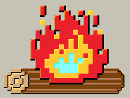

<h1>StarterLog<h1>
<h4>Where Creative Sparks Get Stoked!</h4>

==========

<h3>What is StarterLog?</h3>
StarterLog is a Real-Time Collaboration space for Starters.  We aren't trying to convert the skeptics... we are focused on serving the believers... the people out there that are just doing what they love and delivering great work on their own terms.

We believe that we are the most happy and ultimately more successful when we are free to...  

<b>CREATE</b> new ideas and work on projects we are passionate about. 
<b>SHARE</b> our talent as contributors and our work as open source.  
<b>LEARN</b> from each other and get better at things that matters to us. 
<b>SERVE</b> the community by supporting the causes we believe in. 
 

==========
<h3>About Us</h3>
StarterLog is the current project that is supported by <a href="http://8-bit.me" target="_blank">8-Bit Mellow</a>, a group of open source workafrolics based in <a href="http://thegigcity.com" target="_blank">The Gig City</a>.  

<h3>The <b>WHY</b></h3>
At <a href="http://8-bit.me" target="_blank">8-Bit Mellow</a> we believe that we all...
<ul>
	<li>- possess a deeply human desire to create and to learn.</li>
	<li>- want to be part of something bigger than ourselves.</li>
	<li>- are driven to share our gifts in the service of others.</li>
	<li>- can change the world by doing better by our community.</li>
</ul>

<h3>So... what's with the name <a href="http://8-Bit.me" target="_blank">8-Bit Mellow</a>?</h3>

They had me at 8-Bit. I grew up with technology in the 1980's and it was my experience with 8-Bit computers and 8-Bit gaming consoles where I first fell in love with technology, design, and open source.

Today, it is way to easy to get distracted… to get caught up in the flow of the day to day grind and pulled away from what you love. A new vision and model for our businesses and organizations needs to emerge which is based on intrinsic motivation and self-direction.  I do not think that your passion or hobby is to be considered “mutually exclusive” from your actual work anymore if we are to succeed in breaking through the brick walls and overcome 21st century challenges .

As I look around I see that the world is quickly changing in an incredibly fantastic way where the line between work and play is blurring away and the blending of career and hobby is possible now!
 

Hobby Your Day Job,

-Brian Hooper (Starter | Co-Founder)

